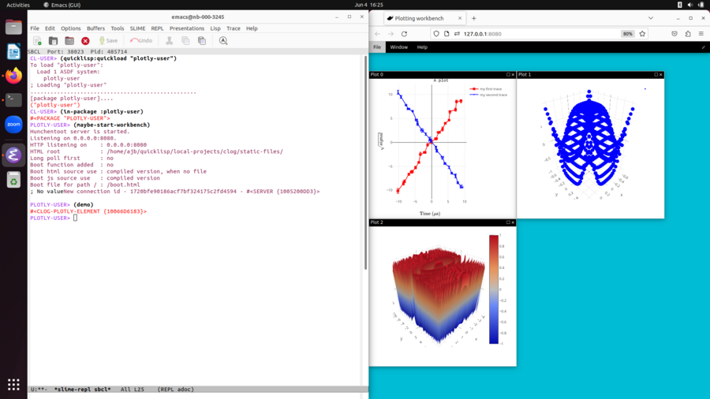

# plotly-user

This package is just in its infancy.

A Common Lisp package for interactive investigation of data sets and
fits using 2D and 3D plots.  The visual interface is browser based using plotly,
but the intent is the user spends most of their time at the Common
Lisp REPL working with data and generating plots in the browser as
they investigate data.

I do want a significant amount of interactivity from the browser based interface
though--- it isn't just going to provide static plots.  That's because I am aiming
to replace my current workflow which uses Matlab.  The interactivity
out of the box of plotly isn't even close to what Matlab provides, but I think
a minimally acceptable feature set is achievable without too much work.  Using
CLOG to push most of the interactivity code to the Common Lisp server side is nice
because I prefer coding in Common Lisp over Javascript, but it's unlikely I'll
completely avoid having to shim things into the Javascript side.

## Installing
```
cd ~/quicklisp/local-projects
git clone https://github.com/ajberkley/plotly-user.git
git clone https://github.com/rabbibotton/clog-plotly.git
git clone https://github.com/rabbibotton/clog.git
git clone https://github.com/fukamachi/lack.git
git clone https://github.com/fukamachi/clack.git
```

```
CL-USER> (quicklisp:quickload "PLOTLY-USER")
CL-USER> (in-package "PLOTLY-USER")
PLOTLY-USER> (maybe-start-workbench)
PLOTLY-USER> (demo)
```

This should result in:


## Main dependencies
[CLOG](https://github.com/rabbibotton/clog): This provides the browser based user interface and is a great framework for quick development of such things.

[SHASHT](https://github.com/yitzchak/shasht): We talk back and forth to the browser through JSON, so need a JSON encoder.  This one worked easily.

[PLOTLY](https://plotly.com/javascript/): The javascript plotly library is the visualization library.

Alexandria: the main collection of lisp niceties.

## Intended interactions

It would be good to support the data-frame used by
[Lisp-Stat](https://github.com/Lisp-Stat).  It would be nice to make
this package work nicely with Lisp-Stat, which uses Vega for the
current plotting which does not handle 3D data sets in a useful way.
